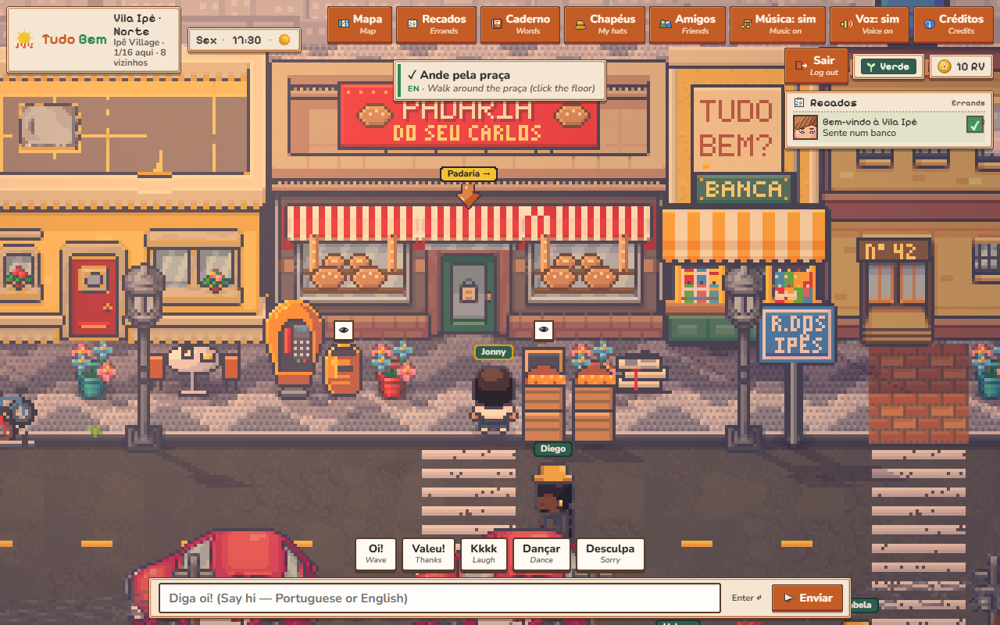
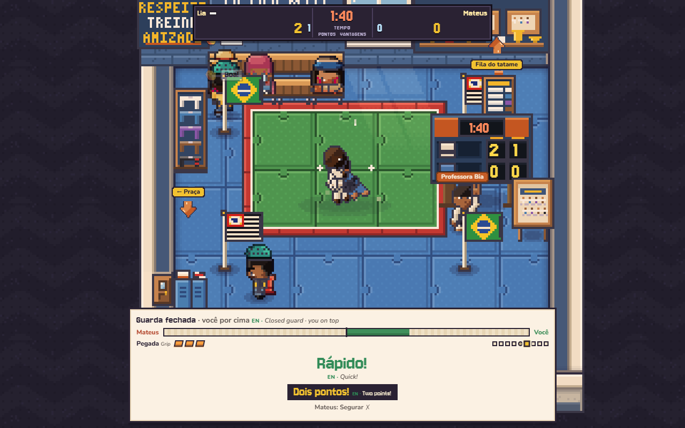
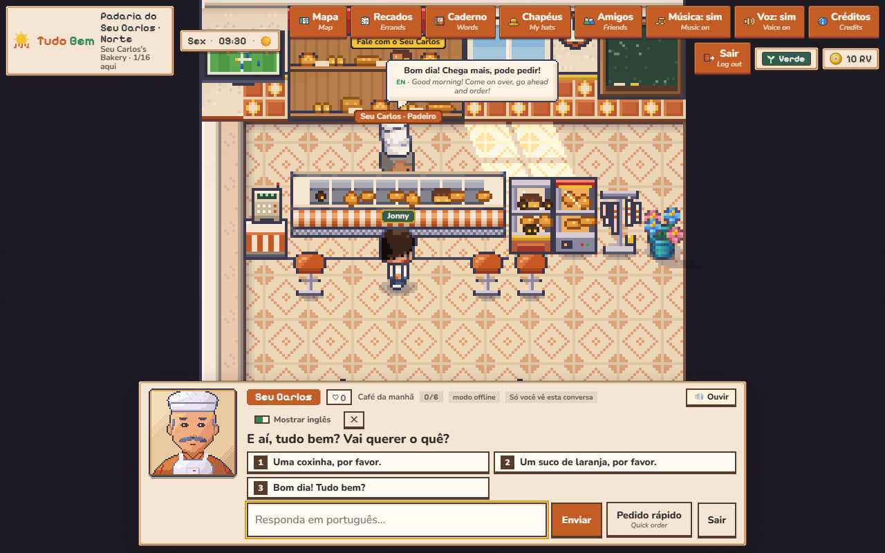
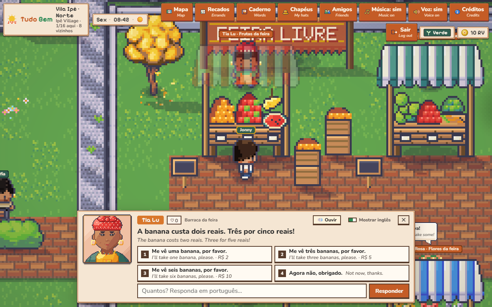

# Tudo Bem

A Brazilian Portuguese learning game that is also a small neighborhood to hang out in. Browser, desktop and phone, top-down pixel art.
**Phase 0 is an adult game: 18+ only** ([age policy](docs/AGE_POLICY.md)).
**Friendly hangout first: learning is the weather.**

## Vila Ipê

You move into **Vila Ipê**, a São Paulo neighborhood with a living clock (one game day is 48 real minutes, the same for everyone), weather
(sol, nublado, garoa, chuva), traffic, a bus, a stray dog and pigeons. The neighbors have routines, remember you, and ask you for small favors
(**recados**). Everything is spoken in Portuguese with an English gloss next to it, and the Portuguese is what you learn by doing the errands:
ordering a coffee, asking "Quanto custa?", greeting someone with the right *bom dia / boa tarde / boa noite*.

| The street at 19:30 | Treino no tatame at the Academia |
| --- | --- |
|  |  |
| **Seu Carlos at the padaria** | **The feira livre: Tia Lu, "Quanto custa?"** |
|  |  |

---

## Run it

Requires **Node ≥ 22.12** and **pnpm 10** (`corepack enable` gives you pnpm).

```bash
pnpm install
pnpm dev          # room server (:8787) + Vite client (:5173) with hot reload
```

Open **http://localhost:5173**. Open a second browser or incognito window to play with a "friend".

Production build (one Node process serves the client and the WebSocket):

```bash
pnpm build && pnpm start      # http://localhost:8787
```

Solo build (the whole authoritative world runs in the browser, no server, profile in `localStorage`):

```bash
VITE_LOCAL_WORLD=1 pnpm --filter @tudobem/client build      # then serve apps/client/dist, or add ?solo to any build
```

## Play path (about 15 minutes)

1. **Title screen, sign in.** A slow pan over Vila Ipê, then a card: **Entrar** (email and password) or **Criar conta** (optional "Tenho 18 anos ou mais" tick, no birth date). Multiplayer needs an account; the solo build lets you in as a guest.
2. **Create your avatar.** Body, skin, face, hair, free starter clothes, and how neighbors address you (*ele / ela / só meu nome*).
3. **Vila Ipê.** Click the floor to walk (or WASD / arrows / the phone joystick), click a bench to sit, type in the chat bar or use the quick words. Júlia, the square guide, starts a short welcome chain (*Bem-vindo à Vila Ipê*, tracked at the top right). Signs you can read show a small eye: click one for a card with the words, a 🔊 button and **Guardar no caderno**.
4. **Padaria do Seu Carlos** (the door with the red awning). Seu Carlos opens a dialogue box with the camera zoomed in: a free **Conversa** (AI-written when a key is configured, authored otherwise) or the **Pedido rápido** breakfast order. Good Portuguese pays more RV (the game's currency). At night (22:00 to 06:00) **Dona Graça** runs the counter.
5. **Recados.** Neighbors offer errands ("Pode deixar!" / "Agora não"): order a café com leite, hand it to Nanda, greet Júlia with the greeting that fits the hour. The **Recados** journal shows what is active and offered today, your **Mochila** (bag) and your **Amizades**. Hearts grow as you help: 2 hearts, the neighbor uses your name; 4, a new Conversa subject (*O bairro*); 6, a gift for your kitnet.
6. **Correria no Balcão** (Counter Rush) behind the counter: customers queue and order out loud (“Me vê um…”), you grab, grill, pour and pack, then serve and answer “Quanto é?”. Three waves, tips, stars and unlocks.
7. **Feira livre** (east lot, every day 06:00 to 13:00, plus the Hortifrúti corner at the banca at any hour). Ask "Quanto custa a banana?", hear the price in words, say how many, then pay with coins and notes. Overpay and you get *troco*; underpay and nothing is bought.
8. **Caderno de palavras.** Every word you see, hear and use fills a notebook by group; finishing a group pays RV.
9. **Hats, kitnet and friends.** Nanda's stall (hats), your kitnet at Nº 42 (decorate, sit), the Academia do Bairro (Professora Bia, tatame, a CPU roll), the parrot perch, friends in the top bar.
10. **Academia: Treino no tatame.** Buy your gi at the vestiário, then join the Fila do tatame with Professora Bia. Each round is one shared minute on the mat. Read the posture (**Perto** → empurre, **Longe** → puxe — a fast partner hides it, a tricky one fakes it), take or clear grips on **gola, manga, calça**, and move at the same time as your partner. A clean step changes the picture. First to **four passos** or a **Final!** wins the round; each win earns a **listra** (four listras change the belt). No quiz — the Portuguese move is what you press, and you hear it when it lands. Lose and **De novo** rematches the same picture.

## How it is built

- **A pixel view over an authoritative world.** `apps/client` draws the world with Phaser 3 (16 px tiles, integer zoom, dual-grid terrain autotiling, layered 16×32 characters, a day/night grade with lamp pools, weather, ambient life) as a *view only*. Input, networking and state live in `main.ts`; text (nameplates, bubbles, the dialogue box, signs, the HUD) is DOM over the canvas so it stays crisp and keeps accents.
- **The server decides.** `apps/server` is a Node `ws` server: movement is A* over tiles, NPC schedules and the clock are pure functions of time, recados, bonds, the Caderno and feira payments are validated server-side. The solo build runs the same `World` in the page.
- **Content is data.** `packages/shared` holds rooms (`rooms.ts`, authored as ASCII terrain plus coordinates), the schedules, recados (from `content/curriculum/phase0/recados.md`), talk trees, hotspots, the feira, the clock and weather. Pure TypeScript with tests next to it.
- **The pixel pipeline.** `apps/client/assets-src` holds the licensed LimeZu packs (16×16 folders only) and the original Brazilian set pieces (generators in `custom/`). `pnpm pixel` turns them into the small `apps/client/public/pixel` folder (atlases, extruded tilesets, character layers, portraits, icons, UI kit and `manifest.json`, deterministic, never edited by hand). See [`apps/client/assets-src/README.md`](apps/client/assets-src/README.md).

```
packages/shared   rooms, schedules, clock, weather, recados, bonds, caderno, feira, hotspots, talk trees, safety, protocol (pure TS, tested)
apps/server       authoritative Node server: world.ts, npcs.ts, recados.ts, feira.ts, caderno.ts, auth.ts, store.ts, app.ts
apps/client       Vite + Phaser 3 view (render/pixel), DOM UI (ui/), pixel UI chrome (styles/)
scripts/          pixel-import.mjs, build-curriculum.mjs, bake-tts.mjs and the e2e / screenshot scripts
docs/lifesim      HOWTO, DECISIONS (every phase), BR-REVIEW (every new Portuguese string)
```

## Checks and tests

```bash
pnpm typecheck    # all packages
pnpm test         # vitest, about 1100 tests (shared rules, server over real HTTP/WS, client logic)
pnpm verify       # typecheck + test + build
pnpm pixel        # rebuild apps/client/public/pixel from assets-src
pnpm content      # regenerate cards.json, recados.json, me-ve-um-orders.json, cpu-names.json from the content markdown
```

### Browser e2e (headless Chrome) and the pinned clock

The game clock is real time (1 game day = 48 real minutes), so Seu Carlos's shift, Nanda's stall, the feira hours, the greetings and the sky all depend on **when you run the test**. The e2e scripts therefore need a server whose clock is **pinned**, and they fail fast with a message when it is not.

```bash
pnpm build
pnpm e2e:all          # starts its own pinned server, runs everything, stops it (needs Chrome; CHROME_PATH is auto-detected)
```

`pnpm e2e:all` runs, against one server started with `TB_TEST_CLOCK_CONTROL=1 TB_TEST_OFFER=carlos_cafe_pra_nanda TB_TEST_ROLL=1`: `e2e` (the whole play path including one full recado), `e2e-feira` (day and night), `e2e-night` (phase a and b), then `e2e:meveum`, which restarts its own server on purpose (a deploy drops the shift) and starts it with the clock pinned to about 08:30 as well.

To run a single script against your own server:

| Server env (test only) | Meaning |
| --- | --- |
| `TB_TEST_CLOCK_CONTROL=1` | Enables `POST /__test/clock?min=510`. Each script sets the hour it needs (08:30 for `e2e`, 08:50 / 15:35 for the feira, 20:52 / 22:15 for the night script) right before it starts. `/healthz` also reports `gameMinute`. |
| `TB_TEST_CLOCK_OFFSET_MIN=<n>` | Alternative: shift the clock once at start. `node scripts/lib/clock-pin.mjs 08:30` prints `n` for any hour; use it within a few minutes, because the clock keeps moving (1 game minute per 2 real seconds). |
| `TB_TEST_OFFER=id,id` | Puts those recados first on every board. `e2e` needs `carlos_cafe_pra_nanda`; without it the script fails (`SKIP_RECADO=1` skips the recado part). |
| `TB_TEST_ROLL=1` | Academia roll hints (and `ROLL_QUEUE_MS=600` to speed up the CPU match). |

```bash
TB_TEST_CLOCK_CONTROL=1 TB_TEST_OFFER=carlos_cafe_pra_nanda TB_TEST_ROLL=1 pnpm start      # terminal 1
pnpm e2e                                                                                    # terminal 2
node scripts/e2e-feira.mjs                  # PHASE=day (default) or PHASE=night
node scripts/e2e-night.mjs                  # PHASE=a or b
```

Common script env: `BASE_URL` (default `http://localhost:8787`), `CHROME_PATH`, `SHOTS_DIR` (save screenshots), `VIDEO_DIR` (`pnpm e2e` only), `HEADED=1`, `CPU_AMBIANCE=off` (when the server runs with `LIVEOPS_CPU_AMBIANCE=off`). The solo build (no server to pin) is covered by `SOLO=1 BASE_URL=<static url> pnpm e2e` (the in-page world gets `?tbclockmin=<n>`, the solo twin of `TB_TEST_CLOCK_OFFSET_MIN`, so it also reads about 08:30; the recado part is skipped) and by `pnpm e2e:solo` (boots as a guest, a tutorial step, one recado accepted, a banana bought at the Hortifrúti, no server traffic). Serve the build with `node scripts/serve-static.mjs apps/client/dist 4173`. Screenshot scripts: `node scripts/readme-shots.mjs` (the four shots above), `scripts/lifesim-shots.mjs` (the review set at 1280×800 and 390×844).

## What's in the box

```
packages/shared   Content + rules shared by client and server (pure TS, tested)
  rooms.ts          Vila Ipê (praça, 56×40) + Padaria, Kitnet, Academia: terrain, props, NPCs, portals, grid, furniture rules
  schedules.ts      NPC daily schedules as a pure function of the game clock (npcMotion.ts walks them)
  clock.ts          the shared game clock, weekdays, greetings; weather.ts the weather
  recados.ts        errands, bag, daily offer; bonds.ts hearts and milestones; caderno.ts the word notebook
  feira.ts          goods, prices in centavos, money in words, change; hotspots.ts the readable signs
  carlos.ts         authored Seu Carlos scene graph; conversa.ts Conversa subjects and prompts
  safety.ts         chat filter: PII regex + EN/PT blocklists → allow / warn / block / escalate
apps/server       Authoritative Node room server (ws). The client is a puppet.
apps/client       Phaser 3 pixel view + DOM UI; the title screen, dialogue box, journal, Caderno, feira tray
```

### Design rules enforced in code

- **Brazilian Portuguese only** in world content; English appears only as glosses and UI subtitles. Every new Portuguese string is listed in [`docs/lifesim/BR-REVIEW.md`](docs/lifesim/BR-REVIEW.md) for a native review.
- **Disney-safe constitution**: no alcohol, dating, sensuality, slurs, politics. Unit tests run every authored line, chip, generated order, hat and furniture name through the filter, and AI-written NPC lines go through the same path.
- **Chat safety**: the Jev stub reads **TB Safety v0.1** from [`content/safety/phase0`](content/safety/phase0) and runs client-side (instant feedback) and server-side (authoritative). Actions are **allow / warn / block / escalate** only, and player chat is **never rewritten**.
  - **block:** PII, contact exchange, slurs, profanity, insults, alcohol, dating/sexual, politics, scams.
  - **warn** (delivered verbatim, with a note): ambiguous words and platonic phrases.
  - **escalate** (hidden, queued as `pending`): self-harm, threats, and context-dependent words.
  - Every v0.1 Jev example, PII example and the PT-slang false-block KPI run in CI. Rate limit 5 msgs / 10 s. Report button on profiles.
- **No pay-to-win**: RV is earned only from graded language acts, recados and the Caderno; nameplates can't be bought. Everyone is **Verde** in Phase 0.
- **The server is authoritative**: movement, rewards, payments, hand-overs and the clock are validated server-side; the client is a view.
- **Adults only (18+) in intent**: the only age prompt is an optional 18+ tick on signup. No birth date is collected. See [docs/AGE_POLICY.md](docs/AGE_POLICY.md).
- **Accounts**: multiplayer requires an email + password account. Passwords are hashed with scrypt; the session is an `HttpOnly; SameSite=Lax` cookie stored only as a SHA-256 hash in `DATA_DIR/accounts.json`, with a 30-day sliding expiry. Failed logins are rate-limited per email and per IP. Auth POSTs and the WebSocket upgrade reject other sites' origins. `/api/conversa` pays RV to the signed-in player only.
- **Idle kick**: no real input for 15 minutes (warning at 14) frees the seat with a soft *"Volte quando quiser"* card. The account stays signed in.

## Content packs

Curriculum and Trust & Safety own [`content/`](content); engineering owns the schema and the code that reads it.

- [`content/curriculum/phase0`](content/curriculum/phase0): do-not-teach, voice sheet, padaria + greetings/numbers lexemes, Me vê um… orders, accept-list rules, and the **recados** (`recados.md`).
  - The markdown is canonical. `pnpm content` regenerates `cards.json`, `recados.json`, `me-ve-um-orders.json` and `cpu-names.json`, and CI fails if any of them drift.
  - Every card and every new line is **DRAFT: needs Brazilian sign-off** (`signoff` / `needs_br`).
- [`content/safety/phase0`](content/safety/phase0): **TB Safety v0.1**, with [`source-v0.1`](content/safety/source-v0.1) as a verbatim copy that CI checks the conversion against.

## Art and credits

The world is top-down pixel art on a 16 px grid. The base art is the licensed **LimeZu** packs (Modern Exteriors and Modern Interiors, 16×16 folders), extended with original Brazilian set pieces authored in the same style: the calçada petit-pavé and the São Paulo mosaic, the padaria, Edifício Ipê and academia fronts, the banca, the orelhão, the kombi and the fusca, the ipê trees, the feira stalls, the portraits and the icons.

> Art: LimeZu, https://limezu.itch.io/

The credit is also in the game (**Créditos** in the top bar) with the fonts (Nunito, Baloo 2, Pixelify Sans), the engine (Phaser 3) and the voices. The licenses and what may be redistributed are in [`apps/client/assets-src/LICENSES.md`](apps/client/assets-src/LICENSES.md): the raw LimeZu files are not redistributed, only the cropped game-ready subset in `public/pixel`. How a sprite goes from source to game: [`assets-src/README.md`](apps/client/assets-src/README.md). The old isometric renderer and its baked art were removed (see [`docs/lifesim/DECISIONS.md`](docs/lifesim/DECISIONS.md), Phase 5 and Phase 10); `docs/art` keeps the review sheets of that era as history.

## Configuration

| Env | Default | Meaning |
| --- | --- | --- |
| `PORT` / `HOST` | `8787` / `0.0.0.0` | Server listen address |
| `DATA_DIR` | `./data` | Profiles (`profiles.json`), accounts + hashed sessions (`accounts.json`), moderation log (`moderation.jsonl`) |
| `XAI_API_KEY` | *(none)* | Optional. Turns on AI Conversa turns, NPC memory summaries and AI-written replies; without it the authored fallbacks play (`CONVERSA_MODEL`, `CONVERSA_REASONING_EFFORT` tune it) |
| `IDLE_KICK_SECONDS` | `900` | Kick players after this long without real input (warning 60 s before) |
| `SESSION_TTL_DAYS` | `30` | Sliding login session lifetime |
| `COOKIE_SECURE` | auto | `auto` sets `Secure` when the request arrived over HTTPS (Fly's `X-Forwarded-Proto`). `1` forces it on, `0` off |
| `ALLOWED_ORIGINS` | *(none)* | Comma-separated extra browser origins allowed to call `/api/auth` and open `/ws`. Same-origin is always allowed |
| `TB_GOOGLE_CLIENT_ID` | *(none)* | Google Cloud OAuth **Web client** ID. When set, the login screen shows **Sign in with Google** and `POST /api/auth/google` verifies GIS ID tokens |
| `TB_GOOGLE_CLIENT_SECRET` | *(none)* | Optional. Not used for the GIS button flow today; set on Fly if you add server-side OAuth later |
| `ROOM_CAP` | `16` | Players per instance (lower it to demo overflow instances, e.g. `ROOM_CAP=2`) |
| `LIVEOPS_CPU_AMBIANCE` | `on` | Praça ambiance CPUs. `off` for empty-room playtests. Solo builds: add `?cpu=off` to the URL |
| `CLIENT_DIST` | auto | Built client directory served by the server |
| `VITE_WS_URL` | same origin `/ws` | Build-time override when the client is hosted separately |
| `TB_SERVER` | `http://localhost:8787` | Dev only: where Vite proxies `/ws` |
| `TB_TEST_*` | *(off)* | Test-only hooks listed under "Browser e2e": clock control / offset, recado offer, roll hints. Never set in production |

URL flags for the client: `?solo`, `?cpu=off`, `?lowfx=1`, `?notype=1` (show dialogue lines whole). In dev builds also `?clock=N&time=HH:MM&weather=sol|nublado|garoa|chuva`; `window.__tb` exposes hooks (`clock`, `perf`, `interact`, `walkTo`, `setClock`) for tests and screenshots.

## Deploy

Two builds:

| Build | What runs | Multiplayer | Command |
| --- | --- | --- | --- |
| **Server** (default) | Node process: `apps/server/dist/index.js` (esbuild bundle) serving `apps/client/dist` + `/ws`. Health: `GET /healthz`. | yes | `pnpm build && pnpm start` |
| **Solo** (static) | The same authoritative `World` runs in the browser; profiles in `localStorage`. Any static host works. A "Modo solo" pill shows in the top bar. | no | `VITE_LOCAL_WORLD=1 VITE_BASE=/ pnpm --filter @tudobem/client build`, upload `apps/client/dist` |

### Get a permanent URL (one-time setup, pick one)

1. **Fly.io, multiplayer (recommended).** Add the repo secret **`FLY_API_TOKEN`**. On the next push to `main`, `.github/workflows/deploy-fly.yml` creates the app and volume on first run, deploys to region `gru`, and smoke-tests `/healthz` (**https://tudo-bem.fly.dev**; set the repo variable `FLY_APP` if the name is taken).
2. **Render, multiplayer.** Dashboard → New → Blueprint → this repo (`render.yaml`). The free plan sleeps and has an ephemeral disk.
3. **GitHub Pages, solo.** Settings → Pages → Source: **GitHub Actions**. `.github/workflows/pages.yml` builds the solo client, runs the solo e2e against it, and deploys on every push to `main`.

Other options: **Docker** (`docker build -t tudo-bem . && docker run -p 8787:8787 -v tb-data:/data tudo-bem`), Fly.io by CLI, Railway (uses the `Dockerfile`, add a volume at `/data`), the solo build on Vercel / Netlify / S3, or an instant preview with `pnpm build && pnpm start` plus `cloudflared tunnel --url http://localhost:8787`.

The pixel art under `/pixel/` is served with `no-cache` (fixed file names written together by `pnpm pixel`), Vite bundles are immutable.

CI (`.github/workflows/ci.yml`) runs typecheck, unit tests, build and `pnpm e2e:all` (its own pinned-clock server, so the result does not depend on the hour the job runs). `pages.yml` also runs the e2e in solo mode (`SOLO=1`) against the static build before deploying.

See **[PHASE0_STATUS.md](PHASE0_STATUS.md)** for what works and the known gaps, and **[docs/lifesim](docs/lifesim)** for the plan ([HOWTO](docs/lifesim/HOWTO.md)), every decision ([DECISIONS](docs/lifesim/DECISIONS.md)) and the native-review pack ([BR-REVIEW](docs/lifesim/BR-REVIEW.md)).
