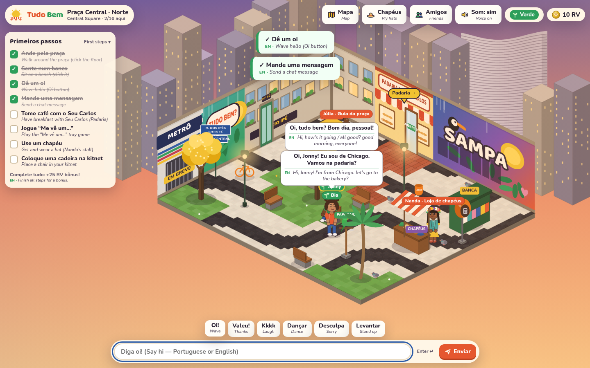
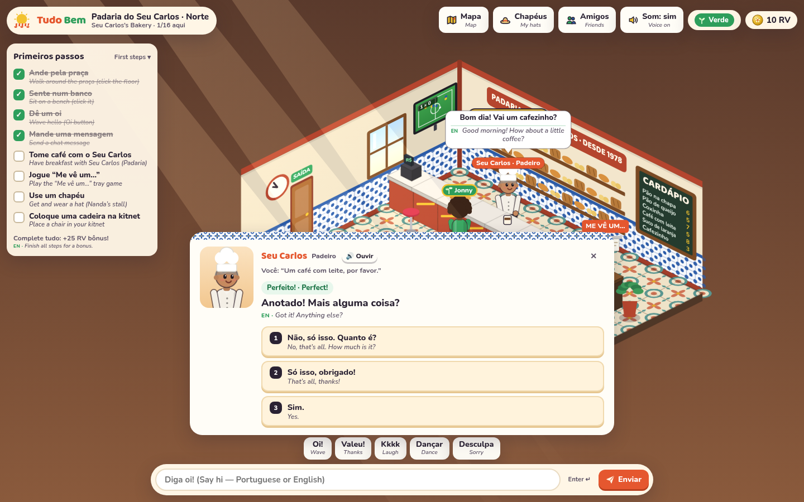
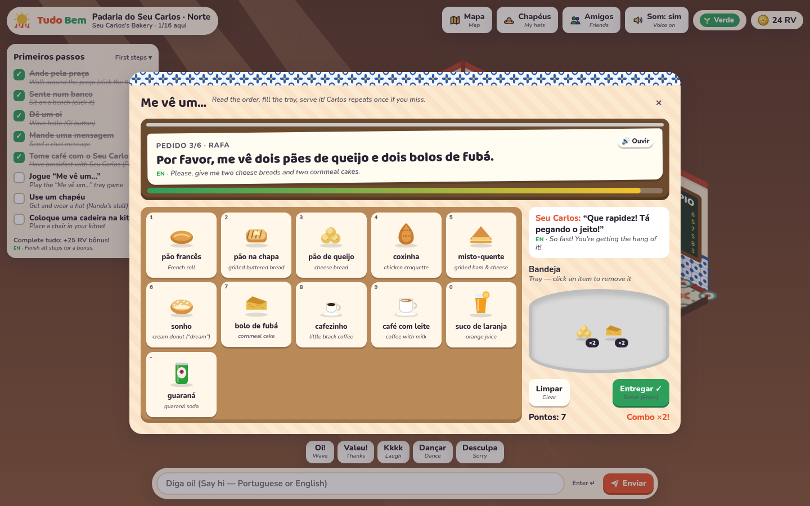
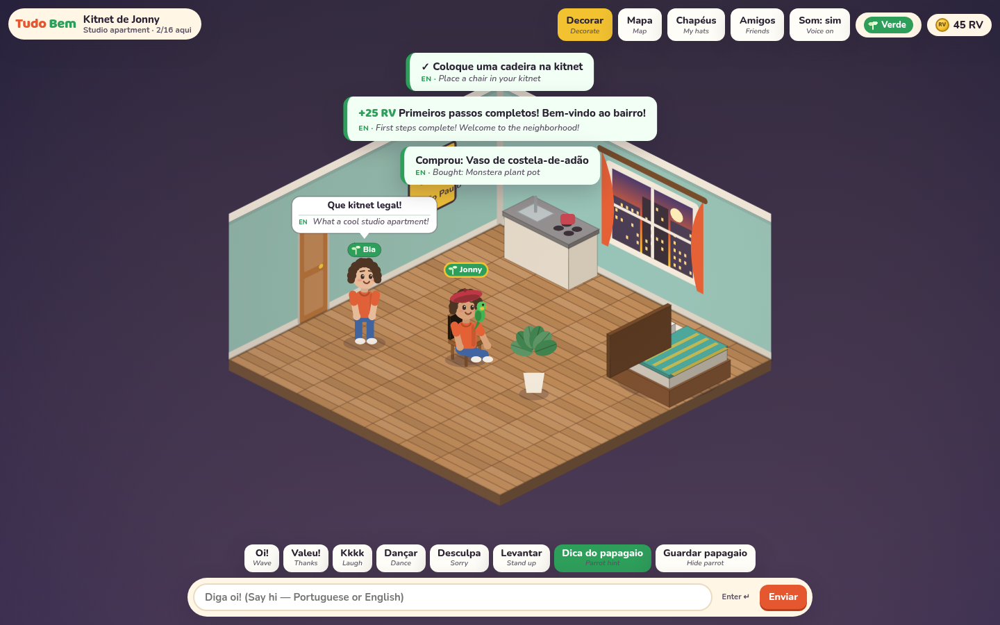

# Tudo Bem

Brazilian Portuguese learning social virtual world (VMK-inspired). Browser, desktop-first, modern 2.5D isometric.
**Phase 0 is an adult game: 18+ only** ([age policy](docs/AGE_POLICY.md)).
**Friendly hangout first — learning is the weather.**

This repo contains the **Phase 0 vertical slice**: Praça Central → Padaria do Seu Carlos → your Kitnet, fully playable end-to-end.

| Praça Central (Verde gloss under PT bubbles) | Seu Carlos breakfast scene (chips only) |
| --- | --- |
|  |  |
| **“Me vê um…” tray minigame** | **Kitnet — place a chair, friend visits** |
|  |  |

---

## Run it (one command)

Requires **Node ≥ 22.12** and **pnpm 10** (`corepack enable` gives you pnpm).

```bash
pnpm install
pnpm dev          # room server (:8787) + Vite client (:5173) with hot reload
```

Open **http://localhost:5173**. Open a second browser/incognito window to play with a “friend”.

Production build (single Node process serves the client and the WebSocket):

```bash
pnpm build && pnpm start      # → http://localhost:8787
```

Checks:

```bash
pnpm typecheck    # all packages
pnpm test         # vitest: safety filter, gloss, scene graph, minigame, rooms, world server, accounts + idle kick over real HTTP/WS
pnpm e2e          # headless-Chrome play-through of the whole Phase 0 path (needs `pnpm start` running)
pnpm verify       # typecheck + test + build
pnpm art          # regenerate + bake all art assets (see docs/art)
pnpm content      # regenerate cards.json, me-ve-um-orders.json, cpu-names.json from the pack markdown
```

`pnpm e2e` env: `BASE_URL` (default `http://localhost:8787`), `CHROME_PATH`, `SHOTS_DIR` (save screenshots), `VIDEO_DIR` (record a slowed-down webm of player 1), `HEADED=1`, `CPU_AMBIANCE=off` (when the server runs with `LIVEOPS_CPU_AMBIANCE=off`).

## Play path (≈10 minutes)

1. **Title screen → sign in** — the Praça with a parrot flock, then a card: **Entrar** (email + password) or **Criar conta** (with an optional **“Tenho 18 anos ou mais”** tick on signup only). No birth date is asked. The shared multiplayer Praça needs an account: **Explorar como visitante** points visitors to Criar conta (it enters the world only in solo builds, which have no server). A signed-in session skips the title screen on reload; **Sair** in the top bar logs out.
2. **Create your avatar** — body, skin, face and detail (glasses, beard, earrings…), hair, free starter clothes, and how NPCs should address you (*ele / ela / só meu nome*).
3. **Praça Central** — click the floor to walk, click a bench to sit, press **Oi!** to wave, type in chat. Júlia (guide, by the quest kiosk) explains the basics. The *Primeiros passos* checklist tracks it all. A few scripted **neighbors** (Verde plates, first names only) sit on benches and stroll to the Padaria door so the square never looks empty; they wave back but never chat, and they don’t take player seats. The **quest kiosk** hands out the *Missão do dia* (Cumprimenta / Pede / Monta → **+25 RV**, once a day).
4. **Padaria do Seu Carlos** — walk through the door with the red awning. Click **Seu Carlos** for the authored breakfast scene (“Pois não. O que vai ser hoje?”). Pick reply chips (keys 1–4) **or type your answer**, which is scored with the curriculum accept-list rules: accents optional, *me dá / quero* accepted with a nudge. Good Portuguese earns more RV; English or vague answers make him rephrase slower. ~5 turns → **6–14 RV**.
5. **“Me vê um…”** — at the ticket rail on the counter. Read (or 🔊 listen to) each Portuguese order from the curriculum ticket list, click items onto the tray (keys 1–0, -, =), toggle modifiers (*pra viagem, pra comer aqui, sem açúcar, bem quente*), then **Entregar** (Enter). Miss once and Carlos repeats slowly; combos pay extra. 6 orders → **8–20 RV**.
6. **Hat** — back in the Praça, visit **Nanda’s stall** (2 free hats, 10 more at 8–60 RV). Buying equips it; **Chapéus** in the top bar is your wardrobe.
7. **Kitnet** — door **Nº 42** (Edifício Ipê). Click **Decorar**, pick your free *cadeira de madeira*, click a tile. **R** rotates. The *Atelier* tab sells more furniture. Click the chair (outside edit mode) to sit.
8. Finish every step → **+25 RV** bonus. Optional: adopt the parrot at the perch (it whispers study words), add friends (click an avatar or **Amigos**), visit a friend’s kitnet.

## What’s in the box

```
packages/shared   Content + rules shared by client and server (pure TS, tested)
  rooms.ts          Praça / Padaria / Kitnet layouts, props, NPCs, portals, grid + furniture rules
  carlos.ts         Authored Seu Carlos scene graph (chips, scores, pronoun agreement, payouts)
  meveum.ts         “Me vê um…” order generator (PT number/gender agreement), tray check, payouts
  safety.ts         Jev-style chat filter stub: PII regex + EN/PT blocklists → allow / warn / block / escalate
  gloss.ts          Phrasebook gloss for Verde plates + EN/PT language detect
  cards.ts          Item-bank cards (GDD §5.5 schema), padaria + greetings deck
  catalog.ts        12 hats, 12 furniture items
  protocol.ts       Typed WebSocket messages
apps/server       Authoritative Node room server (ws). Client is a puppet.
  world.ts          Instances (cap 16, overflow → “· Sul”, “· Leste”…), movement, chat, scene, minigame,
                    shop, kitnet, friends, parrot, tutorial rewards, daily kiosk mission
  ambiance.ts       Praça ambiance CPUs (Live Ops): outside the cap, scripted sit / walk / wave, no chat
  services/         Interfaces + Phase 0 stubs for Jev safety, gloss, NPC dialogue, student model, moderation queue
  store.ts          JSON-file profile store (swap for Postgres)
  auth.ts           Email/password accounts: scrypt hashes, hashed cookie sessions, rate limits, /api/auth/*
  app.ts            HTTP + WebSocket server (createApp), idle sweep; index.ts reads env and listens
apps/client       Vite + Canvas 2D isometric renderer, DOM UI
scripts/e2e.mjs   Playwright-core end-to-end play-through
```

### Design rules enforced in code

- **Brazilian Portuguese only** in world content; English appears only as glosses / UI subtitles.
- **Disney-safe constitution** — no alcohol, dating, sensuality, slurs, politics. Unit tests run every authored Carlos line, chip, generated order, hat and furniture name through the filter.
- **Chat safety** — the Jev stub reads **TB Safety v0.1** from [`content/safety/phase0`](content/safety/phase0) and runs client-side (instant feedback) and server-side (authoritative). Actions are **allow / warn / block / escalate** only, and player chat is **never rewritten** (CEO lock §3).
  - **block:** PII, contact exchange, slurs (incl. *macaco/japa/portuga*), profanity, insults, alcohol, dating/sexual, politics, scams.
  - **warn** (delivered verbatim, with a note): *gostoso/gostosa/pelada* (block if flirt/body-directed), *bar* (unless a clear place-name), platonic *te amo* / *kiss me*, pet names like *gatinha*.
  - **escalate** (hidden, queued as `pending`): self-harm, threats, and *preto/preta* outside color/food context.
  - Every v0.1 Jev example (public chat + NPC replies), every PII example and the PT-slang false-block KPI run in CI. Rate limit 5 msgs / 10 s. Report button on profiles.
- **No pay-to-win** — RV is earned only from graded language acts (scene, minigame) and the tutorial; nameplates can’t be bought. Everyone is **Verde** in Phase 0.
- **No generative NPCs yet** — Carlos is an authored chip graph behind `NpcDialogueService`; an LLM provider can drop in later with the authored one as the Jev-down fallback.
- **Adults only (18+) in intent** — the only age prompt is an optional 18+ tick on signup. No birth date is collected. No under-13/COPPA or parental-consent flows; younger audiences are a later rollout after thorough testing. The constitution and chat safety above apply fully to adults. See [docs/AGE_POLICY.md](docs/AGE_POLICY.md).
- **Accounts** — multiplayer requires an email + password account (a socket without a session gets `authRequired`). An old avatar token can't open an account's avatar; a browser that played before accounts has its avatar linked on first sign-in. Passwords are hashed with scrypt (salted, never stored or logged in plain text). The session is an `HttpOnly; SameSite=Lax` cookie (`Secure` over HTTPS) whose value is stored only as a SHA-256 hash in `DATA_DIR/accounts.json`, with a 30-day sliding expiry. Failed logins are rate-limited per email and per IP. Auth POSTs and the WebSocket upgrade reject other sites’ origins. A browser that played before accounts existed gets its old avatar linked on first signup. `/api/conversa` pays RV to the signed-in player, and never credits an account's avatar without its session.
- **Idle kick** — a player with no real input (walking, chat, clicks, keys; pings don’t count) gets a warning at 14 minutes and at **15 minutes** sees a soft *“Volte quando quiser”* card (not a ban) while their seat is freed. The server decides, so an AFK tab gets kicked even if its client keeps pinging. The account stays signed in, so **Voltar pra Praça** rejoins in one tap.

## Content packs

Curriculum and Trust & Safety own [`content/`](content); engineering owns the schema and the code that reads it.

- [`content/curriculum/phase0`](content/curriculum/phase0) — do-not-teach, Seu Carlos voice sheet, padaria + greetings/numbers lexemes, Me vê um… orders, accept-list rules.
  - The markdown is canonical. `pnpm content` regenerates `cards.json`, `me-ve-um-orders.json` (tickets parsed into tray lines + modifiers) and `cpu-names.json` (Praça ambiance allowlist), and CI fails if any of them drift.
  - Every card is **DRAFT — needs Brazilian sign-off** (`signoff` field).
- [`content/safety/phase0`](content/safety/phase0) — **TB Safety v0.1**: constitution, CEO locks, blocklists, PII regex fixtures, Jev question packs (public chat + NPC replies), ops note, under-13 design note (design only). The JSON packs are converted to the engineering ingest shape (`_meta.status: safety-v0.1`), alongside four engineering overlays (ethnic tokens, politics/religion, scam/RMT, harassment/self-harm).
  - [`content/safety/source-v0.1`](content/safety/source-v0.1) is a verbatim copy of the v0.1 JSON. CI checks that the conversion drops nothing.

## Art

All Phase 0 art is **generated in-repo** by the build agent as procedural canvas and SVG code. That covers the isometric room backgrounds and floors (calçada paulista, ladrilho hidráulico, taco), props (ipê, orelhão, blue street sign, padaria counter and estufa…), kitnet furniture, paper-doll avatar parts, hats, food icons, and UI chrome (icons, RV coin, logo, azulejo/calçada patterns, Copan skyline).

- `pnpm art` bakes static assets to `apps/client/public/art` (PNG + SVG + `manifest.json`), which the game loads at runtime. Animated pieces render live.
- Contact sheets for review: [`docs/art/`](docs/art). Live gallery: **`/art.html`**. Style rules and how to override with hand-painted art: [`docs/art/README.md`](docs/art/README.md).

## Configuration

| Env | Default | Meaning |
| --- | --- | --- |
| `PORT` / `HOST` | `8787` / `0.0.0.0` | Server listen address |
| `DATA_DIR` | `./data` | Profiles (`profiles.json`), accounts + hashed sessions (`accounts.json`), moderation log (`moderation.jsonl`) |
| `IDLE_KICK_SECONDS` | `900` | Kick players after this long without real input (warning 60 s before) |
| `SESSION_TTL_DAYS` | `30` | Sliding login session lifetime |
| `COOKIE_SECURE` | auto | `auto` sets `Secure` when the request arrived over HTTPS (Fly’s `X-Forwarded-Proto`). `1` forces it on, `0` forces it off |
| `ALLOWED_ORIGINS` | *(none)* | Comma-separated extra browser origins allowed to call `/api/auth` and open `/ws`. Same-origin is always allowed |
| `ROOM_CAP` | `16` | Players per instance (lower it to demo overflow instances, e.g. `ROOM_CAP=2`) |
| `LIVEOPS_CPU_AMBIANCE` | `on` | Praça ambiance CPUs. `off` for empty-room playtests. Solo/static builds: add `?cpu=off` to the URL |
| `CLIENT_DIST` | auto | Built client directory served by the server |
| `VITE_WS_URL` | same origin `/ws` | Build-time override when the client is hosted separately |
| `TB_SERVER` | `http://localhost:8787` | Dev only: where Vite proxies `/ws` |

## Deploy

Two builds:

| Build | What runs | Multiplayer | Command |
| --- | --- | --- | --- |
| **Server** (default) | Node process: `apps/server/dist/index.js` (esbuild bundle, `ws` included, no `node_modules`) serving `apps/client/dist` + `/ws`. Health: `GET /healthz`. | yes | `pnpm build && pnpm start` |
| **Solo** (static) | The same authoritative `World` runs in the browser; profiles in `localStorage`. Any static host works. A “Modo solo” pill shows in the top bar. | no | `VITE_LOCAL_WORLD=1 VITE_BASE=/ pnpm --filter @tudobem/client build` → upload `apps/client/dist` |

`?solo` forces solo mode on any build, which is handy for testing.

### Get a permanent URL (one-time setup, pick one)

1. **Fly.io, multiplayer (recommended).** Create a token (`fly tokens create org` or `fly auth token`) and add it as the repo secret **`FLY_API_TOKEN`** (Settings → Secrets and variables → Actions).
   - On the next push to `main`, `.github/workflows/deploy-fly.yml` creates the app and volume on first run, deploys to region `gru`, and smoke-tests `/healthz`. The URL is **https://tudo-bem.fly.dev**.
   - If that name is taken, set the repo variable `FLY_APP`.
2. **Render, multiplayer.** Dashboard → New → Blueprint → this repo (`render.yaml`, Docker, WebSockets supported). The URL is `https://tudo-bem.onrender.com` or similar. The free plan sleeps and has ephemeral disk.
3. **GitHub Pages, solo.** Settings → Pages → Source: **GitHub Actions**. `.github/workflows/pages.yml` then builds the solo client, runs the solo e2e against it, and deploys on every push to `main` to **https://jonnyschipper.github.io/tudo-bem/**.
   - Private repos need GitHub Pro/Team for Pages.
   - Actions can't enable Pages by itself ("Resource not accessible by integration"), so this one click is required.

Other options:

- **Docker** — `docker build -t tudo-bem . && docker run -p 8787:8787 -v tb-data:/data tudo-bem`
- **Fly.io, manual CLI:** `fly launch --no-deploy --copy-config`, `fly volumes create tudobem_data --size 1`, then `fly deploy`.
- **Railway:** New project → Deploy from repo. It picks up the `Dockerfile`; add a volume at `/data`.
- **Vercel / Netlify / S3:** upload the **solo** build. Alternatively, build the client with `VITE_WS_URL=wss://your-server/ws` and run the server elsewhere (Vercel functions don’t hold WebSockets).
- **Instant preview from any machine** — `pnpm build && pnpm start`, then `cloudflared tunnel --url http://localhost:8787` prints a temporary public `https://*.trycloudflare.com` URL.

CI (`.github/workflows/ci.yml`) runs typecheck, unit tests, build, and the browser e2e on every PR. `pages.yml` also runs the e2e in solo mode (`SOLO=1`) against the static build before deploying.

See **[PHASE0_STATUS.md](PHASE0_STATUS.md)** for what works, known gaps, and Phase 1 tickets. The design source of truth is the GDD v1.0.
