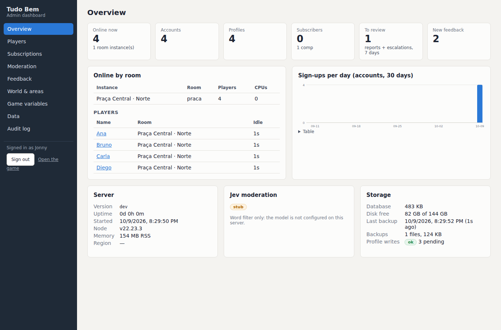

# Admin dashboard

**https://playtudobem.com/admin** is a separate page from the game. It runs on the same Fly server and reads the same SQLite database (`/data/tudobem.sqlite`). It works on a desktop and on a phone.

## Sign in

- Use the same password as the in-game admin gate (`TB_ADMIN_PASSWORD`). Also type your name: it goes in the audit log next to your IP. The password is shared, so the name is a label, not proof of who you are.
- The server sets an httpOnly, `SameSite=Strict` cookie that is only sent to `/api/admin`. It ends after **30 minutes** without a request, and after 8 hours regardless. A server restart signs you out.
- Wrong passwords share one throttle with the in-game gate, `/api/feedback` and `/api/moderation`: after 5 in 15 minutes, that IP must wait.
- With no `TB_ADMIN_PASSWORD` in production, the dashboard is off.

Every `/api/admin/*` route checks the cookie on the server (`apps/server/src/adminApi.ts`). The page holds no data and no secret.

## Sections

| Section | What you can do |
|---|---|
| Overview | See who is online and in which room instance, account and profile totals, sign-ups per day, subscribers and comps, Jev status, uptime, version, disk, database size and the last backup. |
| Players | Search by name, email or id. Sort and filter (online, subscribers, banned, muted, founder, no avatar, test). Click a row for the player page. |
| Player page | See the account, sessions, profile (summary plus raw JSON), kitnet, academy and padaria, moderation history, feedback and billing events. Give or take RV (with a reason), grant or remove hats, furniture, birds, bag items and the gi, see the adopted pets and grant, take out, put away or remove one (Pets card), set belt and stripes, reset tutorial, desembarque, arrival intro or flight in, mute, kick, ban, rename, set the founder flag, sign out all sessions, reset progress, and delete the account. |
| Subscriptions | See Lemon Squeezy subscribers and the webhook event history. Grant or revoke a **comp**. |
| Moderation | See `moderation.jsonl` and reports, filtered by kind or text. See who is muted or banned now. Mute or ban from any row. |
| Feedback | Mark each in-game note new, seen or done, and add a note. |
| World & areas | Switch feira carts off, on or rotation. Set the room cap. Open each room in design mode (the level editor, see [DESIGN-MODE.md](DESIGN-MODE.md)). Reset a room's layout override. |
| Game variables | Edit the values below. |
| Data | Make a backup now, list and download backups, and export accounts or profiles as CSV. |
| Audit log | See every admin change. Look at a snapshot, and restore a reset or a delete. |

Screenshots of every section are in [`screenshots/admin/`](screenshots/admin/). To retake them, run `pnpm build`, then `node scripts/admin-shots.mjs`.

## Rules the dashboard keeps

- **Live state.** Every write goes through the running world and its stores (`World.adminHost()`, `adminOps.ts`). The dashboard never writes SQLite behind the server's back. Online players see RV, items, belts, names and kicks right away.
- **Audit log.** Every write adds one row to `admin_audit`: who, what, which player, a before and after summary, and the time. SQL triggers refuse `UPDATE` and `DELETE` on that table. Downloads and exports are logged too.
- **Destructive actions.** To reset progress, type the player's name. To delete an account, type its email. The rows are copied into the audit log first, so **Restore** can bring them back. A restore brings back the account (with the same login), the profile and the feedback. It does not bring back sessions, photos or moderation entries, because the delete removes those.
- **Reset progress** puts RV, belt, diary, escola, purchases, tutorials and medals back to a new player's. It keeps the login, name, looks, friends, photos, founder marks and any subscription. The player is kicked so the game reloads cleanly.
- **Resetting the tutorial** does not pay the tutorial bonus a second time. **Flight in** plays the plane cutscene on the next sign-in.
- **Rename** follows the same name rules as the avatar creator, then goes through the chat classifier. Only an `allow` renames.
- **Chat text is never edited.** The moderation pages only show it.
- **Pets (#234).** Adoption at the Pet Shop do Seu Dito needs a comp or a paid subscription. **Grant pet** gives one animal (any breed and coat, an optional name with the same letters-only rule) without a comp; it waits at home in the kitnet and follows only while the player has access. **Remove** needs the pet's name typed (or its breed when it has none), and the audit row keeps the pet. **Levar / Em casa** takes a pet out or puts it away without an access check. Up to 6 pets per player. Routes: `POST /api/admin/player/pet-grant`, `/player/pet-remove`, `/player/pet-active`.
- **No money.** A comp gives supporter perks (pets, bubbles) for 1 to 366 days. It is marked COMP everywhere, gives no founder badge or banner, and never touches Lemon Squeezy or a live paid subscription. Do not put Lemon Squeezy test keys on prod.
- **RV grants** are capped by `adminGrantMax` (500 by default). They are an admin tool and they are logged. Players still only earn RV by playing.
- **Feira carts** stay off by default.

## Game variables

Every value is read by the server through `apps/server/src/gameConfig.ts`. Overrides are stored in `kv.gameConfig` and apply live. A value set back to its default stops being an override.

| Key | Default | Range | Read by |
|---|---|---|---|
| `startingCoins` | 10 RV | 0–200 | new profiles |
| `tutorialBonus` | 25 RV | 0–200 | first-steps bonus |
| `kitnetGift` | 10 RV | 0–100 | first visit to your own kitnet |
| `missionReward` | 25 RV | 0–200 | daily kiosk mission |
| `cadernoGroupRv` | 15 RV | 0–100 | completed caderno group |
| `parrotHintCooldownSec` | 45 s | 5–600 | parrot hints |
| `idleKickMinutes` | 15 min | 2–120 | idle kick (overrides `IDLE_KICK_SECONDS`) |
| `roomCap` | 16 | 1–16 | players per instance (overrides `ROOM_CAP`) |
| `adminGrantMax` | 500 RV | 1–5000 | largest single admin RV grant |

The how-to-play page and the kiosk badge still show the shipped number for the tutorial bonus, the mission reward and the caderno bonus. The page warns about this.

**The stripe pace (5 / 10 / 20 / 40 / 80) is shown but locked.** Belts are worked out from total wins, so a new pace would re-rank every player at once and could take stripes away. The client also draws the stripe bar from its own copy of the pace. To change it, edit `packages/shared/src/academia.ts`.

Shop prices are not on the page. The client shows prices from its own copy of the catalogs, so an override on the server would charge a different number than the one players see.

## Version on the overview

The overview shows `TB_GIT_SHA`. The Dockerfile sets it from the `GIT_SHA` build arg. Until the deploy workflow passes `--build-arg GIT_SHA=<sha>`, the overview shows Fly's `FLY_IMAGE_REF` instead.

## Files

- Server: `adminApi.ts` (routes and auth), `adminOps.ts` (actions), `adminSession.ts` (cookie), `adminStores.ts` (`admin_audit`, `billing_events`, feedback status), `adminWorld.ts` (the live-world bridge), `gameConfig.ts`.
- Client: `apps/client/admin.html`, `apps/client/src/admin/`.
- Tests: `apps/server/src/adminApi.test.ts`. They check that every route returns 401 without the cookie, cover sign-in, throttling and CSRF, and test each write action.
