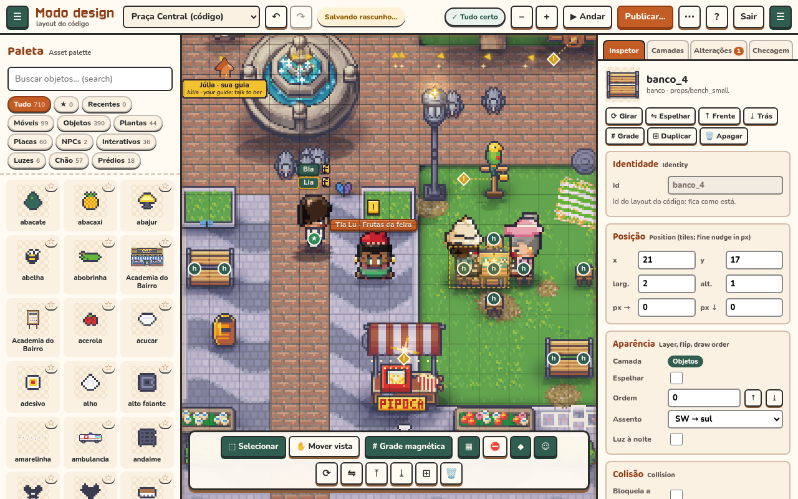
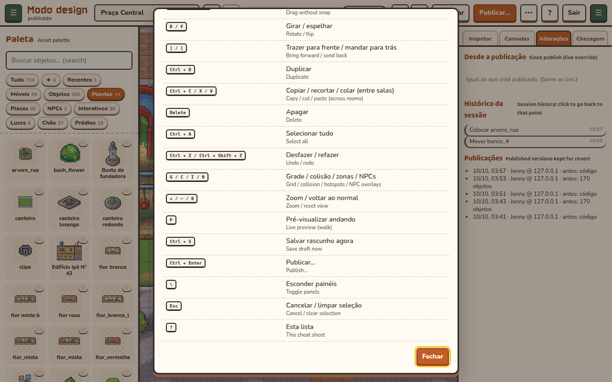
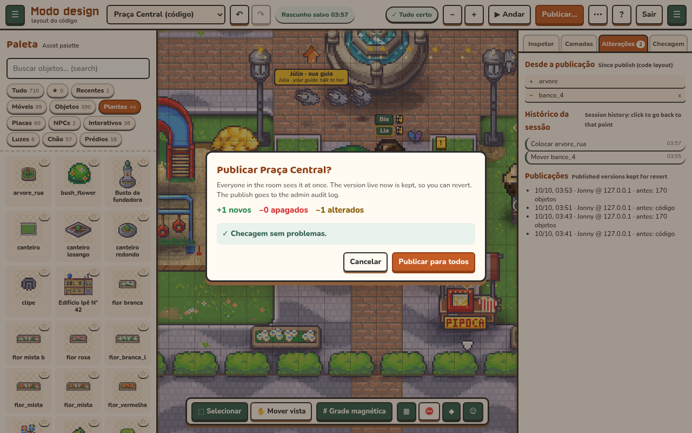
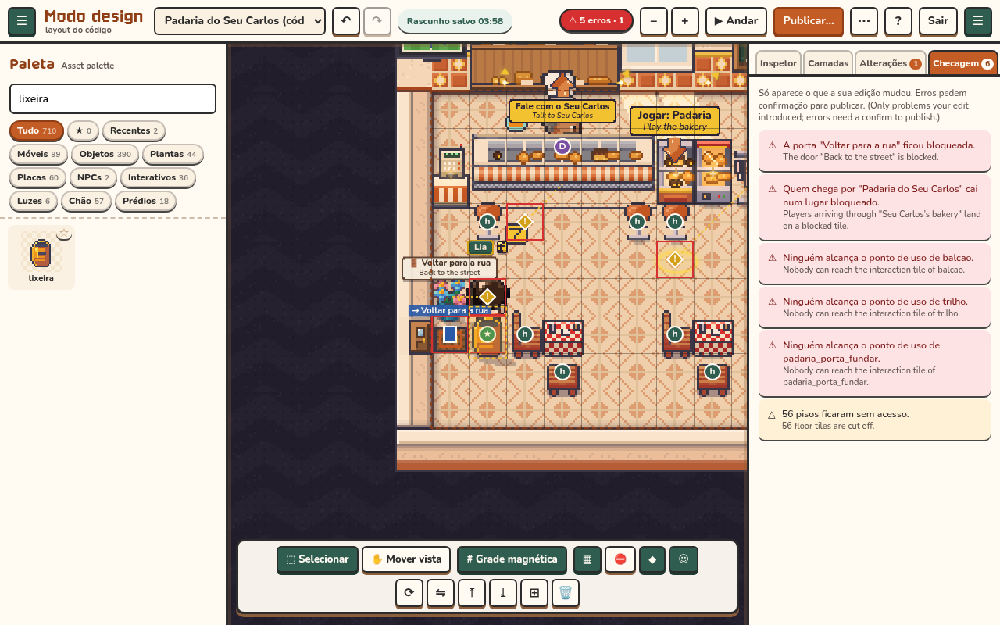

# Design mode

Design mode is the admin level editor for the rooms of Vila Ipê. It runs inside the game, over the live world. You see the room exactly as players will walk it. It edits layouts only: where props stand, what they look like, whether they block, and which existing interaction they open. It does not change gameplay rules.

## Open it

- From the admin dashboard: **World & areas → Open in design mode**. The link is `/?design=<room>`.
- In the game: the hidden admin panel → **Modo design**. It opens on the room you are standing in.

Design mode uses the dashboard's admin session (the `tb_admin` cookie, see [ADMIN.md](ADMIN.md)). If this browser has no session yet, the editor asks for the admin password and your name. Your name goes in the audit log. The server checks the session on every design call (`/api/admin/design/*`), so hiding the button would not be enough to stop anyone.

## The screen

| Part | What it does |
|---|---|
| Top bar | Room picker, undo and redo, draft save state, the checks badge, zoom, **▶ Andar** (live preview), **Publicar…**, the **⋯** menu (discard the draft, revert, reset to code, open a PR or download the file), **?** for shortcuts, and **Sair**. The two **☰** buttons fold the side panels. |
| Palette (left) | Every placeable sprite in the real atlases, plus the props the server gives a meaning to (a counter that opens Correria, a seat, a fence). Search it, filter by Móveis, Objetos, Plantas, Placas, NPCs, Interativos, Luzes, Chão or Prédios, star favorites, and use **Recentes**. Click an item, then click the map. Hold Shift to place several. You can also drag an item onto the map. |
| Inspector (right) | Position in tiles, fine nudge in px, size, layer, flip, draw order, seat facing, light at night, collision, the linked action (with its use tile, picked on the map), the label (PT and EN), the vendor, and fence gates. With nothing selected it lists the room's doors and NPC spots. |
| Camadas | Floor and decals, objects, overhead, and collision. Hide or lock each one. Hiding changes only your view. A locked layer cannot be picked or moved. |
| Alterações | What differs from the live layout (added, removed, changed fields), the session history (click a line to go back to it), and the published versions kept for a revert. |
| Checagem | Problems the edit introduced. **Errors:** a blocked door or arrival tile, or an interaction nobody can reach. **Warnings:** floor cut off, objects off the map, overlapping colliders, an NPC standing inside an object. |
| Tool strip | Select or pan, snap to grid, and the overlays: grid, collision and walkable floor, hotspots (use tiles, doors with their target room, seats, spawn), and NPC spots. With a selection it also shows rotate, flip, forward and back, duplicate, and delete. |

The editor has no waving animations.

## Editing

- **Select:** click a prop. Shift-click adds or removes one. Drag on empty ground for a marquee (Shift adds to the selection). A click lands on the sprite's painted pixels, so the empty corner of a big tree or a street wire falls through to what is under it.
- **Move:** drag, or use the arrows (Shift moves 4 tiles). Snap to grid is on by default (**S**). Alt-drag or Alt-arrows nudges by 1 px.
- **Rotate (R):** turns seats, and sprites that come in facings (`_n/_e/_s/_w`, `_0/_1`). **Flip (F)** mirrors any sprite.
- **Draw order:** **]** brings a prop forward and **[** sends it back. Each press passes whatever overlaps it.
- **Duplicate (Ctrl+D), copy, cut and paste (Ctrl+C / X / V).** The clipboard is kept in the browser, so you can copy in the praça and paste in the feira.
- **Undo and redo** have no limit within the session.
- Ids that come from the code layout cannot be renamed, because other code looks some of them up (signs, photos, the mat). New props can be renamed.

Press **?** for every shortcut.

## Drafts, publish, revert

- **Draft.** Every edit autosaves a private draft on the server (`kv.layouts`), about a second after you stop. Players never see a draft. When you reopen a room, its draft comes back. If someone published the room after your draft was made, the editor asks first.
- **Live preview (P).** Walk your avatar on the draft with the arrows, WASD or a tap. This happens on your screen only. The server and other players still see you where you stood, and you go back there when the preview ends.
- **Publish.** The dialog shows what changed and runs the checks. Errors must be confirmed. The layout goes live for everyone at once, and the version it replaces is kept (the last 5 per room). If another admin published the room after you opened it, you are asked before your version overwrites theirs.
- **Revert** (⋯ menu) puts back the version from before the last publish. **Restore layout do código** puts back the layout shipped in the repo. Both are kept in the history, so you can revert them too.
- **Pull request.** With `TB_GITHUB_TOKEN` set, ⋯ → **Abrir PR com o layout** opens a PR that writes `packages/shared/layouts/<room>.json`. Without the token, it downloads that file. Nothing goes live either way.

Every publish, revert, reset, PR and download adds a row to the admin audit log (`design.publish`, `design.revert`, `design.reset`, `design.pr`, `design.download`). Publish, revert and reset rows keep the replaced layout as their snapshot.

## What it does not edit

- **Doors** (`portals` in `rooms.ts`) and **NPCs** (`npcs`, and `schedules.ts` for their path points) are code and game rules. The editor shows them on the map and in the inspector, read-only.
- The **room size and floor** are not layout data.
- `flip` and `z` are drawing fields. The server stores them and ignores them.

## Files

- Server: `apps/server/src/designOps.ts` (the API), `layoutStore.ts` (live layouts, drafts, history), `designGithub.ts` (the PR).
- Shared: `packages/shared/src/layout.ts` (validation, diff, file format), `layoutCheck.ts` (the checks).
- Client: `apps/client/src/ui/design/` (`editor.ts` is the shell and tools, `inspector.ts`, `overlay.ts`, `assets.ts` for the palette, `model.ts` for history and editing math), `styles/designMode.css`.
- Tests: `apps/server/src/designApi.test.ts` (auth, CSRF, draft, publish, revert, reset, PR, audit), `packages/shared/src/layoutCheck.test.ts`, `apps/client/src/ui/design/*.test.ts`.
- e2e and screenshots: `node scripts/e2e-design.mjs` against a running server (`pnpm build && pnpm start`). The shots go to `docs/screenshots/design-mode/`.
